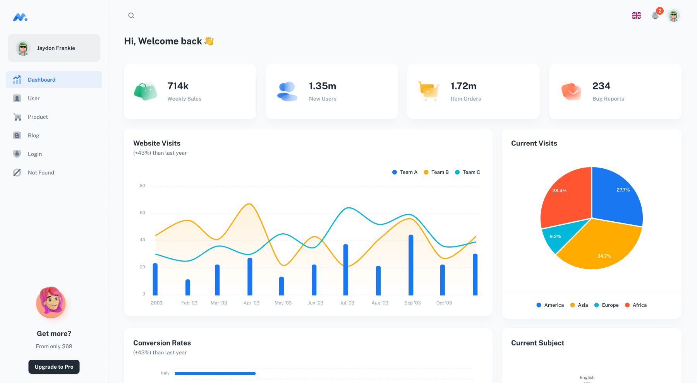

## Admin Panel BoozGame [(version beta)](https://app.icmemployment.net/)

> React App avec Material-UI & ANTD.

## Demo

<!-- - [Dashboard Page](https://app.icmemployment.net/)
- [Competition Page](https://app.icmemployment.net/voting)
- [Actuality Page](https://app.icmemployment.net/blog)
- [Admin Page](https://app.icmemployment.net/users)
- [Login Page](https://app.icmemployment.net/login)
- [Not Found Page](https://app.icmemployment.net/404) -->

## Quick start

- Clone Repo
- Recommended `Node.js v20.x`.
- **Install:** `yarn install`
- **Start:** `yarn dev`
- **Build:** `yarn build`

## License

Distributed under the MIT License. See [LICENSE](https://app.icmemployment.net/LICENSE.md) for more information.

## Contact us

<!-- Email: support@booztechnologie.com -->
